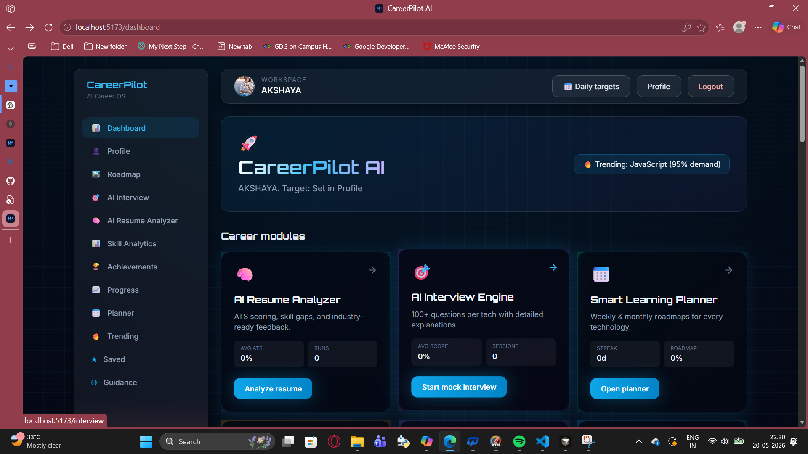
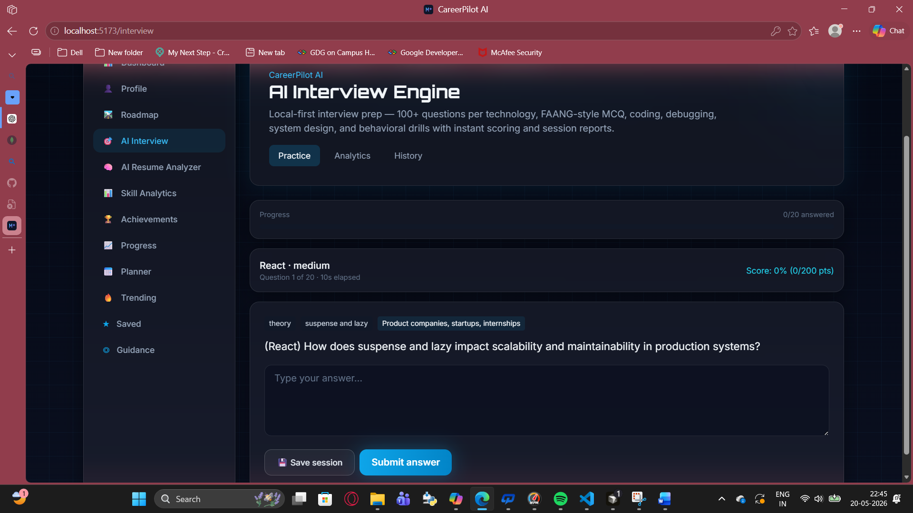
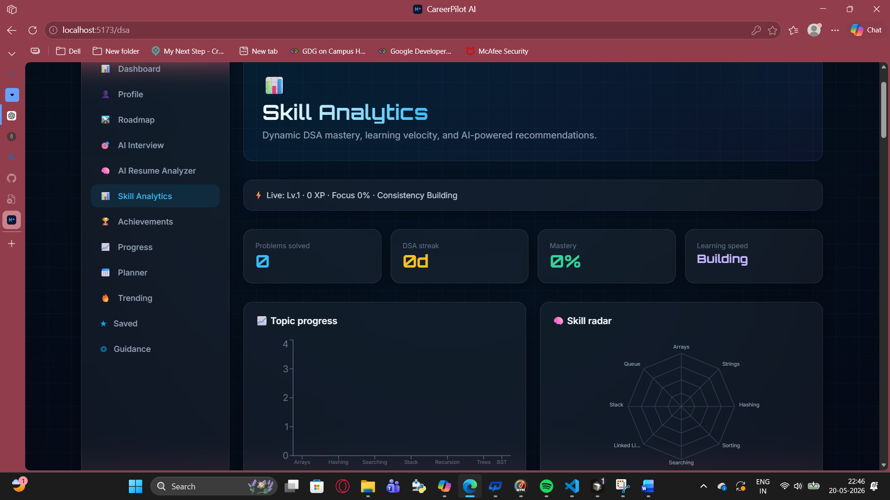
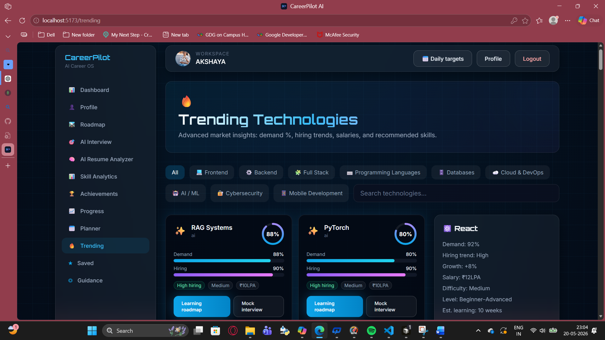
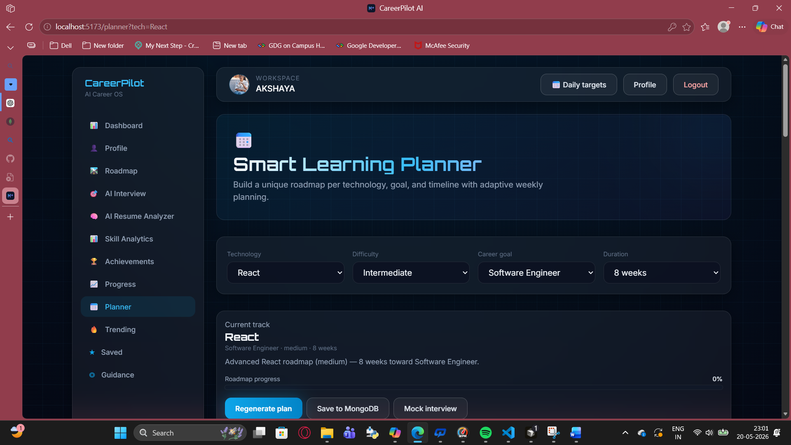
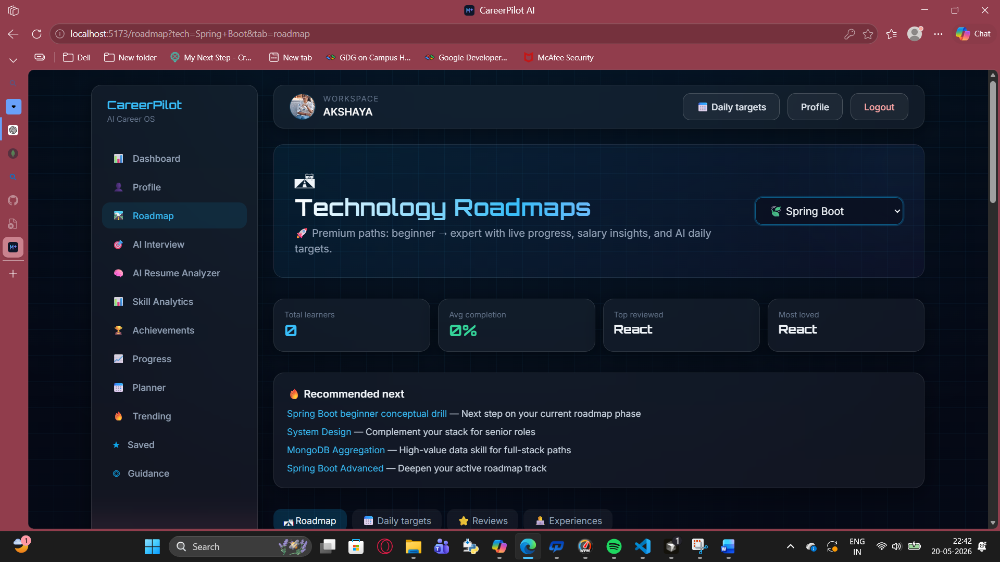

# 🚀 CareerPilot AI

> AI-Powered Career Guidance Platform for Students & Developers

CareerPilot AI is a modern full-stack career development platform that helps users analyze resumes, prepare for interviews, track skills, discover trending technologies, and generate personalized learning roadmaps.

Built with a futuristic UI, AI-powered modules, and real-world developer workflows.

---

# 🌟 Features

## 🧠 AI Resume Analyzer
- ATS-style resume scoring
- Skill gap analysis
- Resume history tracking
- Career-role based evaluation
- Upload PDF/DOCX resumes

---

## 🎯 AI Interview Engine
- Mock interview generation
- Technology-specific questions
- Performance tracking
- Interview history
- Detailed evaluation system

---

## 📈 Skill Analytics Dashboard
- Track learning progress
- Visual skill insights
- Achievement system
- Progress monitoring

---

## 🔥 Trending Technologies
- Real-world technology demand tracking
- Hiring trends
- Salary insights
- Recommended skills
- Categorized technologies

---

## 🗺️ Smart Learning Planner
- Personalized learning roadmap generation
- Weekly & monthly planning
- Technology-based tracks
- Difficulty-level customization

---

## 🔐 Authentication System
- Secure JWT authentication
- Login & signup
- Protected routes
- User profile management

---

# 🛠️ Tech Stack

## Frontend
- React.js
- Vite
- Tailwind CSS
- React Router
- Axios
## Backend
- Node.js
- Express.js

## Database
- MongoDB Atlas
- Mongoose

## Authentication
- JWT (JSON Web Token)
---
# 📸 Project Screenshots

## 🏠 Dashboard


---
## 🤖 AI Interview Engine


---
## 📄 Resume Analyzer


---
## 📈 Skill Analytics


---
## 🔥 Trending Technologies


---
## 🗺️ Smart Planner


---
## 🛣️ Roadmap


---
# ⚙️ Installation & Setup

## 1️⃣ Clone Repository

```bash
git clone https://github.com/your-username/careerpilot-ai.git
cd careerpilot-ai
```

---

## 2️⃣ Install Dependencies

### Frontend

```bash
npm install
```

### Backend

```bash
cd server
npm install
```

---

## 3️⃣ Configure Environment Variables

Create `.env` inside `server/`

```env
PORT=5000

MONGO_URI=your_mongodb_atlas_uri

JWT_SECRET=your_secret_key

GEMINI_API_KEY=your_api_key
```

---

## 4️⃣ Run Project

```bash
npm run dev
```

Frontend:
```plaintext
http://localhost:5173
```

Backend:
```plaintext
http://localhost:5000
```

---

# 📂 Project Structure

```plaintext
careerpilot-ai/
│
├── screenshots/
├── public/
├── src/
├── server/
├── backend/
├── scripts/
├── dist/
│
├── package.json
├── vite.config.js
├── tailwind.config.js
└── README.md
```

---

# 🚀 Future Improvements

- AI chatbot assistant
- Real-time interview simulation
- AI career recommendations
- Community learning system
- Leaderboards & streaks
- Multi-language support

---

# 📊 Key Highlights

✅ Full Stack MERN Project  
✅ MongoDB Atlas Integration  
✅ Responsive Futuristic UI  
✅ JWT Authentication  
✅ AI-Powered Features  
✅ Resume Upload & Analysis  
✅ Real-world Project Architecture  
✅ Professional Dashboard Design  

---

# 🌐 Deployment

Frontend Deployment:
- Vercel

Backend Deployment:
- Render / Railway

Database:
- MongoDB Atlas

---

# 👨‍💻 Developer

## Akshaya Shivayogi

Passionate full-stack developer focused on building AI-powered productivity and career-growth platforms.

---

# ⭐ Support

If you like this project:

⭐ Star the repository  
🍴 Fork the project  
📢 Share with others  

---

# 📜 License

This project is licensed under the MIT License.

---

# 💡 Inspiration

Built to help students and developers:
- Learn smarter
- Prepare better
- Track growth
- Crack interviews
- Build strong careers

---

# 🚀 CareerPilot AI

> Your AI Career Operating System